# dev-box

An always-on development box in a Docker container. It runs Arch Linux, it is
reachable only through Tailscale SSH (Headscale works too), it applies the
[dotarchy/common-no-omarchy](https://github.com/c4software/dotarchy/tree/main/common-no-omarchy)
config as-is, and its dev tools are managed by [mise](https://mise.jdx.dev/).

- `tailscaled` runs inside the container and Tailscale SSH opens the shell. Nothing
  is published on the host. Without Tailscale (`TS_DISABLE=true`), the box falls back
  to its own OpenSSH server on a published port, public key only.
- SSH lands you in zsh inside a tmux session named after the box (`TS_HOSTNAME`,
  `dev-box` by default), in your home directory.
- Dotfiles are pulled from a git repo and applied without running its install scripts.
- Landing in the box prints one command to try, drawn at random, and a line when an
  update is waiting.
- Nothing updates behind your back. There is a background check every 24 h, a line at
  login, and `devbox update` when you decide.
- One command, `devbox`, gathers everything the box can do for you.
- Two persistent volumes, home and projects, that survive image rebuilds.
- System packages come from pacman (image), dev tools from mise (home).

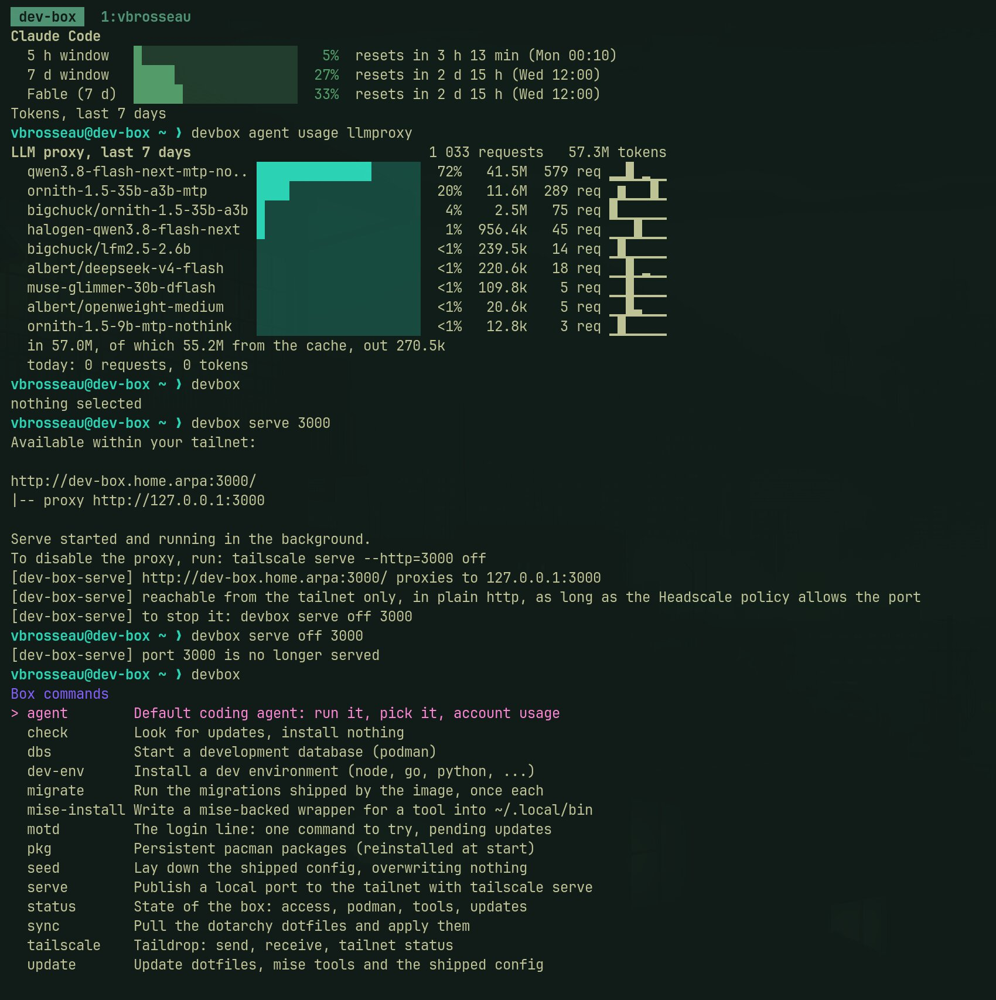

## Quick start

1. Create `.env` from the example, set `TS_LOGIN_SERVER` if you use Headscale, and add
   `GITHUB_TOKEN` (recommended):

   ```bash
   cp .env.example .env
   ```

2. Build and start:

   ```bash
   docker compose up -d --build
   docker compose logs -f
   ```

   The logs print the login URL to open to attach the box to your tailnet.

3. From any machine on your tailnet:

   ```bash
   ssh dev@dev-box
   ```

The first start seeds the home, syncs the dotfiles and installs the mise tools:

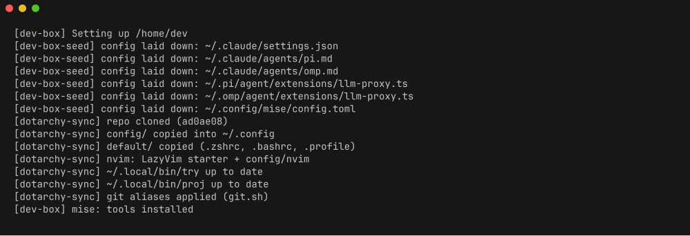

Machine-specific settings, such as extra volumes or resource limits, go in a local
override that Compose merges automatically and git ignores:

```bash
cp compose.override.example.yaml compose.override.yaml
```

### Raspberry Pi 5 (arm64)

The image builds and runs on arm64 as it does on amd64. `docker compose up -d --build`
picks the right base by itself. On the Pi, `archlinux:latest` is replaced by the
community image `menci/archlinuxarm:base` (Arch Linux ARM, rebuilt daily). That is a
third-party base, not an official Arch one, which is the price of arm64 here.
`mise` is not packaged for Arch Linux ARM either, so the build falls back to the
official installer from `mise.run`. Everything else comes from pacman as usual.

What was actually tested: the arm64 build and first start were validated under QEMU
emulation. mise installs through the `mise.run` installer, the arm64 assets for
`claude`, `pi`, `codex` and `omp` are picked automatically, and LazyVim compiles its
parsers.
Rootless podman could not be tested under emulation, because user namespaces fail
under qemu-user. It still has to be confirmed on a real Pi, together with `/dev/fuse`
and the AppArmor setup of Raspberry Pi OS.

On the host:

- Docker >= 24 with Compose v2 (`docker compose version`); Raspberry Pi OS 64-bit.
- `/dev/net/tun` present (the stock kernel has it).
- `zstd` for `just backup` and `just restore`.
- `just` is not in apt: use `mise use -g just`, or run the `docker compose` commands
  by hand.

Building on the Pi takes a while, because of `base-devel`, neovim and tree-sitter.
Expect the first build to be measured in tens of minutes, not minutes.

## Host commands

A `justfile` at the root wraps the Compose invocations you would otherwise type
by hand. Install [just](https://just.systems) (`sudo pacman -S just` on Arch,
`mise use -g just` anywhere else), then run `just` to list everything:

| Command | Does |
| --- | --- |
| `just up` | Build if needed and start the box |
| `just rebuild` | Update Arch: rebuild from a fresh base image, then restart |
| `just down` | Stop and remove the container (`./data/` is kept) |
| `just restart` | Restart without rebuilding |
| `just logs` | Follow the entrypoint logs (last 100 lines) |
| `just status` | Container state, healthcheck, and whether the image lags the repo |
| `just shell` | `zsh -l` inside the box, as your user |
| `just ssh` | SSH in, through Tailscale or the published port |
| `just update [what]` | Run `dev-box-update` in the box, same as `devbox update` (`dotfiles`, `tools`, `seed`, `all`) |
| `just backup [dest]` | Write a backup archive (see *Backup*) |
| `just restore <archive>` | Restore one |

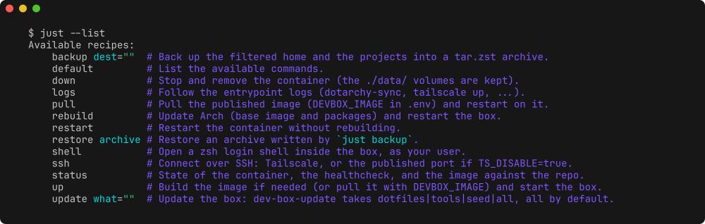

Use `just rebuild` when Arch moves. It runs `docker compose build --pull --no-cache`.
`--pull` alone is not enough: as long as the base image keeps the same digest, the
`pacman -Syu` layer stays cached and the packages remain frozen at the date of the
first build.

The recipes read `.env`, so `just shell` and `just ssh` follow `USER_NAME`,
`TS_HOSTNAME`, `TS_DISABLE`, `SSH_BIND` and `SSH_PORT` without extra configuration.

## Configuration

All settings live in `.env` (see `.env.example`):

| Variable | Default | Meaning |
| --- | --- | --- |
| `USER_NAME` | `dev` | Unix user inside the box (UID/GID fixed at 1000:1000) |
| `USER_SHELL` | `/bin/zsh` | Login shell |
| `TZ` | `Europe/Paris` | Timezone |
| `PROJECTS_DIR` | `./data/projets` | Host directory mounted at `~/projets` (separate from the home) |
| `TS_HOSTNAME` | `dev-box` | Tailscale hostname; also the container hostname and the tmux session name |
| `TS_LOGIN_SERVER` | `https://controlplane.tailscale.com` | Control server: Tailscale itself (the default), or your Headscale URL |
| `TS_AUTHKEY` | empty | Auth key; empty means the login URL is printed in the logs |
| `TS_EXTRA_ARGS` | empty | Extra arguments appended to `tailscale up` |
| `TS_DISABLE` | `false` | `true` means no Tailscale, the box runs its own sshd instead |
| `SSH_AUTHORIZED_KEYS` | empty | Public key(s) allowed when `TS_DISABLE=true`, one per line |
| `SSH_BIND` | `127.0.0.1` | Host interface the SSH port is published on |
| `SSH_PORT` | `2222` | Host port mapped to the box's port 22 |
| `DOTARCHY_REPO` | `https://github.com/c4software/dotarchy.git` | Dotfiles repo |
| `DOTARCHY_BRANCH` | `main` | Branch to track |
| `DOTARCHY_SUBDIR` | `common-no-omarchy` | Subfolder holding `config/`, `default/`, `install/` |
| `UPDATE_CHECK_INTERVAL` | `86400` | Update *check* period in seconds (`0` turns it off); it installs nothing |
| `PODMAN_ENABLE` | `false` | Start the rootless podman socket at boot; needs the podman block of `compose.override.example.yaml` |
| `MISE_INSTALL_ON_START` | `true` | Reinstall missing mise tools in the background at start (no version bump) |
| `GITHUB_TOKEN` | empty | Token with no scopes, avoids GitHub API rate limits during mise installs |
| `LLM_PROXY_URL` | `http://llmproxy` | Endpoint used by the `llm-proxy.ts` extension of pi/omp |
| `LLM_PROXY_API_KEY` | `unused` | Its API key |

`compose.yaml` already carries what the box needs from the host: `/dev/net/tun` plus
the `NET_ADMIN` and `NET_RAW` capabilities for `tailscaled`. No `privileged`, no host
Docker socket. Rootless podman needs more, see *Containers inside the box*, and is
therefore opt-in.

## Headscale setup

On first start the box prints a login URL in `docker compose logs -f`. Open it, or
feed it to `headscale nodes register`, to attach the machine. The node identity is then
kept in `./data/tailscale`, so this happens only once.

Tailscale SSH is refused without an `ssh` rule in the policy, and the `ssh` rule alone
does not open the network. As soon as the policy contains `grants` or `acls`, traffic to
the box must be allowed too, otherwise port 22 is filtered. This policy was validated with
Headscale v0.29.3 (`headscale policy check`):

```json
{
  "grants": [
    { "src": ["alice@"], "dst": ["alice@"], "ip": ["*"] }
  ],
  "ssh": [
    { "action": "accept", "src": ["alice@"], "dst": ["alice@"], "users": ["dev"] }
  ]
}
```

- `src` and `dst`: the Headscale user owning the machines, the one the box was
  registered to.
- `users`: the Unix account inside the box (`USER_NAME`).
- A `user@` SSH destination requires `src` to contain only that same user.

### Reaching a dev server

A server listening on `0.0.0.0` inside the box is already reachable from the tailnet
at `http://<TS_HOSTNAME>:<port>`, as long as the Headscale policy allows the port. The
example grant above does, with its `"ip": ["*"]`. Nothing else to set up, and a server
bound to `127.0.0.1` is not reachable that way.

`devbox serve` is the other form: `tailscale serve` proxies the port for you, which also
works for a server bound to `127.0.0.1` only.

```bash
devbox serve 3000          # tailscale serve --bg --http=3000 3000
devbox serve 8080:3000     # listen on 8080, proxy to 127.0.0.1:3000
devbox serve --on 8080 3000   # the same thing, written out
devbox serve --tcp 5433:5432  # raw TCP passthrough
devbox serve status        # what is served right now
devbox serve off 3000      # stop that one, or "off all" for every mapping
```

It prints the URL it published, `http://dev-box.home.arpa:3000/`. A single port means the
same port on both sides; the first port of a pair is the one the tailnet sees, the second
is the port the app listens on in the box.

HTTPS and Funnel are not available with Headscale: the https mode answers
`error 501 Not Implemented`, so this is plain http, inside the tailnet, and never on the
Internet. To reach the port from outside the tailnet, map it in `compose.override.yaml`
or tunnel it with `ssh -L 3000:127.0.0.1:3000 dev@dev-box`.

## SSH without Tailscale

Set `TS_DISABLE=true` in `.env` and the box starts its own OpenSSH server instead of
`tailscaled`. Public key only. Password and root login are refused:

```bash
TS_DISABLE=true
SSH_AUTHORIZED_KEYS="ssh-ed25519 AAAA... you@laptop"
SSH_BIND=127.0.0.1   # 0.0.0.0 to expose it on the LAN
SSH_PORT=2222
```

```bash
ssh -p 2222 dev@127.0.0.1
```

The keys are rewritten into `~/.ssh/authorized_keys` at every start, so `.env` is the
source of truth. Host keys are generated once into `~/.config/dev-box/ssh` and live in
the persistent home, so you never get a "host key changed" warning after a rebuild.

With `SSH_AUTHORIZED_KEYS` empty, sshd is not started at all. The container stays up
and reports unhealthy, and you get in with `docker exec -it -u dev dev-box zsh -l`.

## Connecting

```bash
ssh dev@dev-box
```

The login shell runs `exec tmux new-session -A -s "$(hostname)" -c ~`. You always land
in the same tmux session, named after the box, starting in your home directory. Running
several boxes side by side therefore gives each one a session of its own. To get a plain
shell instead:

```bash
ssh -t dev@dev-box env NO_TMUX=1 zsh
```

The user is created at container start, if missing, with UID/GID 1000:1000, zsh as
shell and passwordless sudo. The home itself is persistent.

### Copying to the clipboard

The image ships `/usr/local/bin/wl-copy` and `wl-paste`. The `copy` function of the
dotarchy config calls `wl-copy`, and there is no Wayland in the box, so the shim does
two things instead. It puts the text in the tmux buffer, which you paste with
prefix + `]`, and it relays it to the terminal with OSC 52. That also fills the
clipboard of the machine you are connected from over SSH, as long as its terminal
supports OSC 52. Alacritty, Ghostty, Kitty and foot do. Outside tmux the shim sends
OSC 52 directly. `wl-paste` prints the tmux buffer back.

### Taildrop

`devbox tailscale` moves files between the box and the other machines of your
tailnet, without going through a shell on the host.

```bash
devbox tailscale send laptop notes.md build.log
devbox tailscale receive              # waits, saves into ~/inbox
devbox tailscale receive --once ~/tmp # one delivery, then stop
devbox tailscale status               # the link and its peers
```

`receive` loops on `tailscale file get --wait`, so it can sit there for hours;
`--once` returns after the first delivery. The default directory is `~/inbox`,
created if missing. With `TS_DISABLE=true` there is no tailnet at all, and the
command says so and exits 1 rather than failing obscurely.

Taildrop also works with Headscale, version 0.23 and later, between machines
that belong to the same user.

## The devbox command

`devbox` is the front door to everything the box can do. It is modelled on the
`omarchy` command of the Omarchy desktop, in a much smaller shape.

```bash
devbox                 # menu of commands, pick one and it runs
devbox status          # what the box is doing right now
devbox update tools    # run a command with its arguments
devbox seed --help     # summary, usage, then the command's own help
devbox --help          # usage and the table of commands
devbox commands        # bare list, one name per line, for completions
```

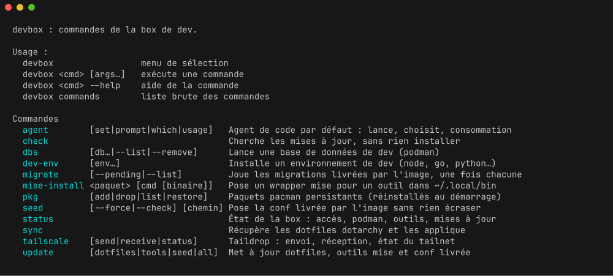

There is no hardcoded list. `devbox` scans the executables of `/usr/local/bin`
and reads a comment header at the top of each one:

```bash
# devbox:name=update
# devbox:summary=Update dotfiles, mise tools and the shipped config
# devbox:args=[dotfiles|tools|seed|all]
# devbox:hidden=true    # optional: out of the menu and the list, still routable
# devbox:requires=tailscale   # optional: hidden too while that feature is off
```

Adding a command therefore means dropping a `dev-box-<name>` script in
`rootfs/usr/local/bin/` with those three lines. Nothing to register anywhere.

| `devbox` | Binary | Does |
| --- | --- | --- |
| `status` | `dev-box-status` | image commit and repo, Tailscale or sshd, podman, mise tools, pending updates |
| `check` | `dev-box-check-updates` | look for what could be updated, install nothing |
| `update` | `dev-box-update` | `dotfiles`, `tools`, `seed`, or all of them |
| `seed` | `dev-box-seed` | lay down the config shipped by the image |
| `sync` | `dotarchy-sync` | pull the dotfiles and apply them |
| `dev-env` | `dev-box-dev-env` | install or remove a dev environment with mise |
| `dbs` | `dev-box-dbs` | start a development database in a podman container |
| `agent` | `dev-box-agent` | the default coding agent: run it, pick it, read its usage |
| `motd` | `dev-box-motd` | the login line: one command drawn at random, pending updates |
| `migrate` | `dev-box-migrate` | run the migrations shipped by the image, once each |
| `mise-install` | `dev-box-mise-install` | write a mise-backed wrapper into `~/.local/bin` |
| `pkg` | `dev-box-pkg` | pacman packages that survive an image rebuild |
| `serve` | `dev-box-serve` | publish a local port to the tailnet with `tailscale serve` |
| `tailscale` | `dev-box-tailscale` | Taildrop send and receive, tailnet status |

Every one of them keeps its own name on `PATH`, so `dev-box-update dotfiles` and
`devbox update dotfiles` are the same thing. The `justfile` and the entrypoint
call the binaries directly. `dev-box-podman` carries `hidden=true`: it is the
wrapper behind the `docker` and `podman` symlinks, not a command you call.
`dev-box-tailscale` and `dev-box-serve` carry `requires=tailscale`: with
`TS_DISABLE=true` they leave the menu and the list, but `devbox tailscale` and
`devbox serve` still answer, with the reason.

Without arguments, `devbox` opens a gum menu listing the commands with their
summary, and runs the one you pick, which may then be interactive itself. With
no terminal it says so and prints the list instead of hanging.

### The default coding agent

`devbox agent` remembers one agent for the box, in `~/.config/dev-box/agent`,
and launches it in the current directory.

```bash
devbox agent                 # menu: run the default, pick one, see the usage
devbox agent set             # gum menu, then remember the choice
devbox agent set codex       # or name it outright
devbox agent which           # print the current default
devbox agent prompt "review this project"
devbox agent usage claude    # what is left of the account limits, and the tokens
devbox agent usage proxy     # what went through the LLM proxy
devbox agent usage           # the three of them, Claude Code, Codex, LLM proxy
```

In a terminal, a bare `devbox agent` opens a small menu: run the default agent
here, pick the default, or show the usage of Claude Code, of Codex, of the LLM
proxy, or of all three.
Without a terminal it runs the default agent directly. The list of agents is what
the image ships, `claude`, `pi`, `omp`, `opencode` and `codex`, plus any wrapper
`devbox mise-install` has written.

`devbox agent usage` prints one line per limit window, with a twenty cell bar, the
percentage used and a countdown to the reset in the box's timezone
(`resets in 2 h 13 min (16:45)`). It keeps everything local: nothing is cached on
disk and nothing is sent anywhere. For Claude Code it reads the OAuth token out of
`~/.claude/.credentials.json` and asks Anthropic's usage endpoint, so the token only
ever travels in that one Authorization header. Without credentials it says to run `claude` and `/login`.
For Codex it talks to `codex app-server` over stdin, which is where Codex keeps
its rate limits; when that answers nothing it says so and points at `/status`
inside Codex.

Under the limits comes a `Tokens` block, the same one for the three accounts:
one line per model, with its share of the window as a twenty cell bar, that
share, the tokens, the number of requests and a sparkline of the seven days,
today on the right. The models are sorted by share and everything past the
eighth is folded into one `others` line. Two lines close the block, the input
and output totals and what today weighs:

```
Tokens, last 7 days                                11 884 requests   1.5G tokens
  claude-opus-5    ███████████░░░░░░░░░  57%  874.2M 8.5k req ▂▅▆▆█▂▆
  claude-fable-5-1 ████████░░░░░░░░░░░░  41%  643.0M 3.0k req ▂▄▆▆█▂▄
  claude-sonnet-5  ░░░░░░░░░░░░░░░░░░░░  <1%   15.1M  292 req ▁▅█▃▃▁▁
  in 1.5G, of which 1.5G from the cache, out 7.0M
  today: 1 828 requests, 232.4M tokens
```

Those counts are read from the transcripts the agents themselves write in the
home, `~/.claude/projects` for Claude Code and `~/.codex/sessions` for Codex.
Nothing is fetched for them and nothing is written: the files are read as they
are. A request is one assistant message for Claude Code and one token count
event for Codex. The days are cut at local midnight in the box's timezone, and
counts are printed short, `12.3k` or `4.5M`, exact below a thousand.

`devbox agent usage proxy` is the same block for the LLM proxy, under its own
heading, with one difference: the bar is still the share of the window, but the
percentage next to it is the cache hit rate of the model, the part of its input
served from the cache. Red below 50, yellow below 80, green above, and a bare
`?` for a model that read no input at all. A header line names the columns:

```
LLM proxy, last 7 days                            3 300 requests   734.9M tokens
  model         share                cache  tokens      req 7 days
  claude-opus-5 ██████████████░░░░░░  88%  513.1M 2.2k req ▃▁▁▇▁▁█
  gpt-5-codex   ██████░░░░░░░░░░░░░░  66%  211.6M  920 req ▁▁▇▁▁▁█
  mistral-large ░░░░░░░░░░░░░░░░░░░░  15%   10.2M  100 req ▁▁▁▁█▁▆
  in 730.0M, of which 594.5M from the cache, out 4.9M
  today: 1 760 requests, 386.5M tokens
```

The models are still sorted by tokens, largest first. Those figures do not come
from a transcript but from the proxy's own usage route,
`/v1/organization/usage/completions` on `LLM_PROXY_URL`, called with
`LLM_PROXY_API_KEY`, in hourly buckets so the days line up with the box's. The
cached tokens are the part of the input that was served from a cache, in every
account, so they are counted inside the input and never twice. When the proxy
does not answer, the section says so in one line and nothing else.

## The login message

Landing in the box prints one line, once per tmux session and once per shell
outside tmux: a command of the box drawn at random, and what it does. A second
line, in yellow, appears when an update is waiting. It is `devbox motd`. It
reads nothing but the box itself, no network and no cache, and costs a few
milliseconds.

```
Tips: devbox dbs postgres redis  start these databases, data kept in a volume
2 updates available, run devbox update
```

The commands come from the `TIPS` list at the top of the script, drawn with
`shuf`; the ones that need Tailscale stay out when `TS_DISABLE=true`. The
updates line folds `~/.cache/dev-box/updates` into a count; the detail of what
is waiting stays in `devbox check` and `devbox status`. Everything else, the
box, its commands and where the coding accounts stand, is one command away:
`devbox`, `devbox status` and `devbox agent usage`.

## Dotfiles sync

`dotarchy-sync` clones or updates the dotfiles repo into `~/.local/share/dotarchy`
and takes only the config. It never runs the repo's install scripts.

| Source in the repo | Destination in the home |
| --- | --- |
| `config/` (zsh, tmux, starship, lazygit, btop, ...), except `nvim` | `~/.config/` |
| `default/zshrc`, `default/bashrc`, `default/profile` | `~/.zshrc`, `~/.bashrc`, `~/.profile` |

- `config/nvim` is a LazyVim overlay. It is applied on top of the official LazyVim
  starter and rebuilt on each pass. `lazy-lock.json` belongs to the box and is kept.
  A pre-existing `~/.config/nvim` not managed by the sync is renamed to `.bak.<timestamp>`.
- `try` and `proj`, used by the `p` alias and the `Ctrl+F` widget, are downloaded into
  `~/.local/bin` from the URLs found in `install/bootstrap.sh`. Any tool added to
  the repo the same way is picked up automatically.
- Git aliases (`co`, `br`, `ci`, `st`, `s`, `pull.rebase`, ...) come from the `setup`
  function of `install/git.sh`, which only makes `git config --global` calls.
- tmux is reloaded if it is running.

It runs on the very first start, then only when you ask for it: `devbox sync`, or
`devbox update dotfiles`. There is no periodic sync.

Edit the config in the repo, not in the box. Copied files are overwritten on every
pass. For box-only tweaks, put them in `~/.config/dev-box/overrides/`, a mirror of the
home: `overrides/.config/tmux/tmux.conf` becomes `~/.config/tmux/tmux.conf`. They are
re-applied at the end of every sync, after the steps that overwrite, nvim included.

Not replicated: the rest of `bootstrap.sh` (keyboard layout, shell choice) and
`install/nvim.sh`. Its tweaks (`relativenumber = false`, `gb` remapped to `<C-^>`) only
apply here if they live in `config/nvim`.

## Tools

**pacman (image).** Everything the common-no-omarchy config and `try`/`proj` call
(zsh, tmux, mise, gum, starship, zoxide, fzf, eza, bat, ripgrep, fd, lazygit, jq,
neovim, luarocks, tree-sitter-cli), the base (tailscale, rsync, base-devel, ...) and
rootless podman (see *Containers inside the box*).

- Update Arch: `just rebuild`, or `docker compose build --pull --no-cache && docker compose up -d`.
- A `sudo pacman -S` inside the box is lost on rebuild. Add the package to the
  `Dockerfile` for good, or let `devbox pkg` put it back at every start.

### Persistent packages

`devbox pkg` is the middle ground between a bare `sudo pacman -S`, which is
gone at the next rebuild, and an edit to the `Dockerfile`, which means a commit
and a rebuild. It installs the package and writes its name into
`~/.config/dev-box/packages`, which lives in the persistent home.

```bash
devbox pkg add ripgrep-all htop   # install, and remember
devbox pkg list                   # the list, and whether each one is there
devbox pkg install                # fuzzy picker over the Arch repositories
devbox pkg drop htop              # uninstall, and forget
devbox pkg restore                # put back whatever is missing
```

At every start the entrypoint reads that list and reinstalls what the image
does not have, in the background, without holding up the login. The log line is
`[dev-box] pkg: N package(s) reinstalled`.

Only packages come back. A config file you edited by hand in `/etc`, a systemd
unit, a file dropped in `/usr/local/bin`: none of that is tracked, and none of
it survives. The durable answer stays the `Dockerfile` in the repository.

### Extra tool wrappers

`claude`, `pi`, `omp`, `opencode` and `codex` already have a wrapper in
`/usr/local/bin` that installs them through mise on the first call.
`devbox mise-install` writes the same kind of wrapper for anything else:

```bash
devbox mise-install npm:@google/gemini-cli gemini
devbox mise-install crush
devbox mise-install --list        # the wrappers written this way
devbox mise-install --remove gemini
```

It takes `<package> [command [binary]]` and writes `~/.local/bin/<command>`.
The wrapper runs `mise use -g --quiet <package>`, then
`mise x <package> -- <binary>`, with `MISE_MINIMUM_RELEASE_AGE=0` so asking for
a tool by name gets today's release. `~/.local/bin` comes before
`/usr/local/bin` on the `PATH`, so a wrapper written here takes over from the
one in the image when it carries the same name.

**mise (persistent home).** Dev tools declared in `~/.config/mise/config.toml`:

- `node` (LTS)
- `claude` (Claude Code, `aqua:anthropics/claude-code`)
- `pi` (`aqua:earendil-works/pi`)
- `codex` (OpenAI Codex CLI, `aqua:openai/codex`)
- `omp` (`github:can1357/oh-my-pi`, via mise's github backend)

`claude`, `pi`, `omp`, `codex` and `opencode` are wrapped in `/usr/local/bin`. Each
wrapper runs `mise use -g <tool>`, a no-op once the tool is declared, then
`mise x <tool> -- <cmd>`. The command therefore works on first call, even before the
background install finished, or after the tool was removed from
`~/.config/mise/config.toml`. `opencode` is not pre-installed: its first call
installs it.

They are installed in the background on first start. Follow progress with
`tail -f ~/.cache/dev-box-install.log`. Later starts only reinstall what is missing
(`MISE_INSTALL_ON_START`), and never bump a version. Upgrading is explicit:
`devbox update tools` runs `mise install` then `mise upgrade`. Add more on demand,
for example `mise use -g go@latest`. Set `GITHUB_TOKEN`, no scopes needed, to avoid
GitHub API rate limits.

### Dev environments

`devbox dev-env` installs or removes a whole language environment in one call,
through mise. No `curl | sh`, and no pacman except for PHP (see below). Whatever
mise installs is declared in `~/.config/mise/config.toml`, survives a rebuild, and
is upgraded by `devbox update tools` like the rest.

```bash
devbox dev-env --list             # what is on offer, and what is installed
devbox dev-env node go            # install these two
devbox dev-env --remove node go   # remove them
devbox dev-env                    # menu: install or remove, then several at a time
```

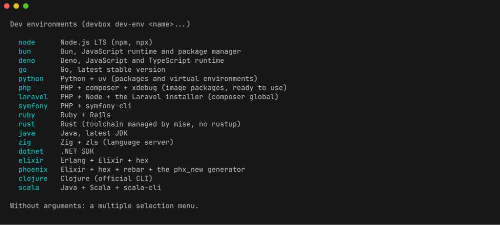

Without arguments it first asks whether to install or remove, then opens a gum menu
with multiple selection, the environments on the left and their description on the
right. The remove menu only offers what is installed. Running it again on an
environment already installed, or already removed, changes nothing.

A removal takes the tools out of `~/.config/mise/config.toml` with `mise unuse -g`,
which also prunes the versions no other config needs. It only removes what the
environment itself brought: `laravel` drops the installer but keeps PHP and Node,
`phoenix` drops the `phx_new` archive but keeps Elixir, `scala` keeps Java, and the
message says how to remove the base. Project data is never touched: `~/go`,
`~/.cargo`, `~/.mix`, `~/.m2`, `~/.config/composer` and the like stay where they
are, so a later `devbox dev-env <name>` finds everything back.

A few of them do more than pull a runtime. `python` also installs `uv`. `ruby` writes
`~/.gemrc`, turns off `ruby.compile` so mise takes a precompiled build instead of
spending minutes on a compiler, and installs Rails. `elixir` runs `mix local.hex`,
and `phoenix` adds rebar and the `phx_new` generator. `rust` is the mise toolchain,
not rustup, so there is a single place where versions are declared. `android` is the
platform-tools only, `adb` and `fastboot`, taken from the zip Google publishes,
through mise's http backend: no SDK manager, no platform, no Java. That URL carries
no version, so `devbox update tools` cannot refresh it; run `devbox dev-env android`
again to take the latest build. Google publishes no arm64 build, so on an arm64 box
the command points to `devbox pkg add android-tools` instead.

PHP is the one exception. mise can only build PHP from source, which takes minutes
and needs a pile of development headers, so `php`, `composer`, `php-sqlite`,
`php-gd`, `php-sodium` and `xdebug` are pacman packages baked into the image, with
the usual extensions and xdebug already enabled at build time. `devbox dev-env php`
only checks and shows what is there. `laravel` adds Node and the Laravel installer
through `composer global`, kept in `~/.config/composer`, which is in the PATH and in
the persistent home. `symfony` adds `symfony-cli` through mise's github backend.

OCaml is not offered: upstream it goes through the opam installer, which would be
wiped by the next image rebuild.

### Containers inside the box

`docker run`, `docker build` and `docker compose` can work inside the box, without
the host's Docker socket and without a privileged container. What answers is
[podman](https://podman.io/) running rootless as your user. It is off by
default, because nesting it forces the box's own isolation open: the seccomp
profile, the read-only `/proc/sys` and AppArmor all have to be lifted for the
container, which makes a container-to-host escape easier than it is otherwise.
To turn it on:

1. uncomment the podman block (`/dev/fuse` and the three `security_opt`) in
   `compose.override.example.yaml`, copied to `compose.override.yaml`;
2. set `PODMAN_ENABLE=true` in `.env`;
3. `just up`.

Then:

- `podman-docker` provides `/usr/bin/docker` as a shim over the `podman` CLI;
- the entrypoint starts `podman system service` as your user on
  `/run/user/1000/podman/podman.sock`, and login shells export
  `DOCKER_HOST=unix:///run/user/1000/podman/podman.sock`, so Compose v2 (the
  `docker-compose` package, a real Docker plugin) and anything else that talks to
  the socket finds it;
- images live in `~/.local/share/containers`, in the persistent home. They are outside
  the backup, so they re-pull.

```bash
docker run --rm alpine echo ok
docker build -t mine .
docker compose up -d && docker compose ps
```

With `PODMAN_ENABLE=false` no socket is started and `DOCKER_HOST` is not set.
`docker` and `podman` then go through a wrapper that stops with the three steps
above instead of an obscure error:

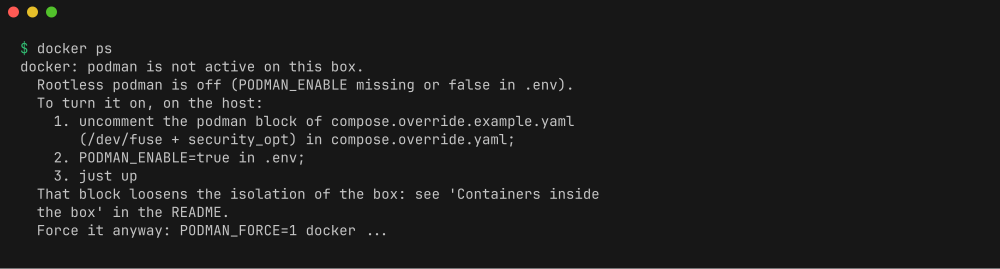

The same wrapper points to `~/.cache/dev-box-podman.log` when podman is enabled but
the socket never came up. `PODMAN_FORCE=1 docker ...`, or `/usr/bin/podman`, bypasses it.

Known limits:

- Containers started here are rootless. There is no `--privileged` inside the box,
  publishing a port below 1024 is refused, since it would need
  `net.ipv4.ip_unprivileged_port_start` lowered, and UIDs are mapped: a file
  written as root in a container belongs to `100000` on the host side of the
  bind mount.
- Networking goes through pasta/slirp4netns rather than a host bridge. Published
  ports are reachable from inside the box (`curl localhost:8080`). Reaching them
  from your laptop means going through the box's own address (Tailscale).
- Storage uses `fuse-overlayfs`, since overlayfs cannot always stack on the
  overlay the box itself runs on. It is correct everywhere, and slower than native
  overlay on heavy I/O.
- Docker on the host still owns the box itself. `just up`, `just rebuild` and
  friends run on the host, not in here.

### Databases

`devbox dbs` starts a development database in a podman container inside the box.
Same images and same development options as `omarchy-install-docker-dbs` on the
host: no password, or a password you already know. It needs rootless podman
enabled (the section above). Without it, it prints the three steps and stops
instead of starting half of the containers.

```bash
devbox dbs                          # menu, several at a time
devbox dbs postgres redis           # start these two
devbox dbs --list                   # image, port and current state of each
devbox dbs --stop redis             # stop it, keep everything
devbox dbs --start redis            # start it again
devbox dbs --remove redis           # drop the container, keep the data
devbox dbs --remove --purge redis   # drop the data too, asks for confirmation
```

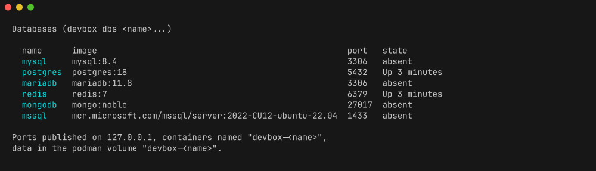

| Name | Image | Port | Credentials |
| --- | --- | --- | --- |
| `mysql` | `mysql:8.4` | 3306 | user `root`, empty password |
| `postgres` | `postgres:18` | 5432 | user `postgres`, `trust`, no password |
| `mariadb` | `mariadb:11.8` | 3306 | user `root`, empty password |
| `redis` | `redis:7` | 6379 | none |
| `mongodb` | `mongo:noble` | 27017 | `admin` / `admin123` |
| `mssql` | `mcr.microsoft.com/mssql/server:2022-CU12-ubuntu-22.04` | 1433 | `sa` / `@dmin123`, amd64 only |

Each container is named `devbox-<name>` and keeps its data in a podman volume
called `devbox-<name>`. `--remove` drops the container and leaves the volume, so
`devbox dbs <name>` right after comes back on the same data. `--purge` is the
only thing that deletes it, and it asks first.

`mysql` and `mariadb` both want port 3306: starting the second one is refused,
with the name of the one already running. `mssql` has no arm64 image, so it is
refused on a Raspberry Pi 5 rather than failing on a pull.

Ports are published on `127.0.0.1`, as they are on the host, so a database is
reachable from inside the box only: `psql -h 127.0.0.1 -U postgres`. From your
laptop, go through an SSH tunnel to the box:

```bash
ssh -L 5432:127.0.0.1:5432 dev@dev-box
```

Nothing restarts on its own, here as everywhere else in the box. After a restart
of the container, bring a database back with `devbox dbs postgres`, which starts
the existing container instead of creating a new one, or with
`devbox dbs --start postgres`.

## Agent configuration

This is about the files the agents read. Picking which agent runs, and reading
its account limits, is `devbox agent`, above.

A base config is shipped in the image and laid down in the home by `dev-box-seed`,
which runs at every start and on `dev-box-update seed`. A reference copy of what was laid
down is kept in `~/.config/dev-box/seed/<path>`, which gives three cases per file:

- **missing**: the shipped file is copied and recorded as the reference;
- **untouched** (identical to the reference) and the shipped version changed: it is
  updated in place (`config updated: ~/x`);
- **modified locally** and the shipped version changed: nothing is overwritten, the
  box tells you the new version exists and how to take it with
  `dev-box-seed --force ~/x`, also written `devbox seed --force ~/x`.

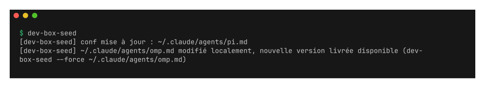

A box created before the reference existed simply adopts the shipped version as its
reference on the next start, without overwriting anything.

| File | From |
| --- | --- |
| `~/.claude/settings.json` | `rootfs/etc/devbox/claude/settings.json` |
| `~/.claude/agents/{pi,omp}.md` | `rootfs/etc/devbox/claude/agents/` |
| `~/.pi/agent/extensions/llm-proxy.ts` | `rootfs/etc/devbox/llm-proxy.ts` |
| `~/.omp/agent/extensions/llm-proxy.ts` | same file |
| `~/.config/mise/config.toml` | `rootfs/etc/devbox/mise-config.toml` |

- `settings.json`: theme, effort level, empty commit/PR attribution, and the
  `harness@c4software` plugin from its GitHub marketplace. There is no `model` key, so
  Claude Code picks its own default. Claude Code rewrites this file by itself, so it goes
  to "modified locally" almost immediately. That is expected. A new shipped version is
  reported, never forced.
- `pi.md` and `omp.md`: Claude Code sub-agents that delegate a task to the `pi` and `omp`
  CLIs. They only run when asked for explicitly.
- `llm-proxy.ts` registers the Albert (DINUM) provider in pi and omp. It reads
  `LLM_PROXY_URL` and `LLM_PROXY_API_KEY` from `.env`. If the endpoint is unreachable it
  registers nothing rather than blocking startup.

Login shells get those two variables from `/etc/devbox/env`, written at start and
sourced by `/etc/devbox/zshenv`. Neither Tailscale SSH nor sshd inherits the
environment of PID 1.

### Agent skill

The image also ships a skill that teaches a coding agent how this box works, the same
way Omarchy ships one for the desktop. It lives in
`/usr/share/devbox/skills/devbox/`, a `SKILL.md` plus four guides:

| File | Covers |
| --- | --- |
| `SKILL.md` | when the skill applies, the safety rules, command discovery, a decision framework |
| `architecture.md` | what belongs to the image, what belongs to the home, what a start does, the seed, overrides, podman |
| `commands.md` | `devbox` and every command it dispatches to |
| `extending.md` | how to change the box for good, through the repository |
| `updates.md` | what updates, when, and on whose command |

The entrypoint links it into the home at every start, so it follows the image without
going through the seed:

```
~/.claude/skills/devbox     -> /usr/share/devbox/skills/devbox
~/.pi/agent/skills/devbox   -> same
~/.omp/agent/skills/devbox  -> same
```

Claude Code reads `~/.claude/skills`, and pi and omp read the `skills` directory of
their own agent folder. All three pick the skill up on their own. `codex` has no
equivalent skill directory, so it is not linked anywhere.

The point is the rule it carries: never edit `/usr/local/bin`, `/etc/devbox` or
`/usr/share/devbox` inside the box, because those come from the image and a change
there disappears silently on the next rebuild. Reading them is encouraged. Changes go
to `~/.config/dev-box/overrides/`, to `~/.config/mise/config.toml`, or to this
repository followed by `just rebuild`.

Adding a guide means dropping an `.md` file in
`rootfs/usr/share/devbox/skills/devbox/` and listing it in the Topic Guides section of
`SKILL.md`. There is nothing else to register.

## Updates

Nothing is updated automatically. A background check runs at start and every
`UPDATE_CHECK_INTERVAL` seconds, 24 h by default, `0` turns it off. It only fetches
metadata, all of it by git commit hash where there is one: the dotfiles repo HEAD
(`git ls-remote` against the local clone), the dev-box repo HEAD against the commit
the image was built from, `mise outdated`, and the shipped config files whose
version changed. What it finds goes into `~/.cache/dev-box/updates`,
one line per item. When there is nothing left, the file is removed.

The login message folds that file into one line, `2 updates available, run
devbox update`, once per tmux session. The detail stays one command away, in `devbox
check` and in `devbox status`. With no file, there is no such line. See *The
login message* above.

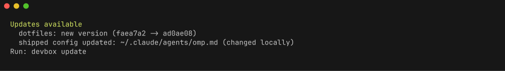

```bash
devbox update            # all of the below
devbox update dotfiles   # dotarchy-sync
devbox update tools      # mise install, then mise upgrade
devbox update seed       # shipped config (see above)
```

`dev-box-update` is the binary and keeps working under that name. `devbox update` is
the form to remember. Migrations are separate, see below.

It clears the flag and re-runs the check when it is done.

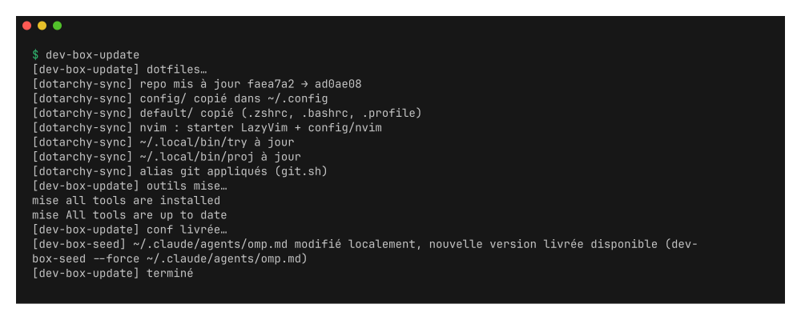

### Migrations

A new image sometimes needs a one-off repair in an existing home, something the
seed cannot pick up on its own. Those repairs are shipped as migrations, small
scripts in `/usr/share/devbox/migrations/` named after a timestamp. They run as
your user, once each, in order, and the names already played are recorded in
`~/.config/dev-box/migrations`.

```bash
devbox migrate              # run what is pending
devbox migrate --pending    # list it without doing anything
devbox migrate --list       # all of them, played or pending
```

This is the one thing the box does on its own at start, because a migration
comes with the image that needs it: the entrypoint runs `dev-box-migrate` right
after the seed. The first start of a brand new box marks every migration as
played without running any, since there is nothing to repair in an empty home.
A migration that fails stops the run, the ones behind it stay pending, and
`devbox migrate` tries again.

The one item it cannot act on is the image itself. That line points to `just rebuild`,
or `just up`, on the host. The image learns its commit at build time: `just` passes
it as a build argument, and a bare `docker compose build` reads it from the clone the
build runs in. Only a build from a context without `.git` (a tarball) records
`unknown`, and that check is then skipped. `just status` on the host makes the same
comparison, image commit against the local checkout:

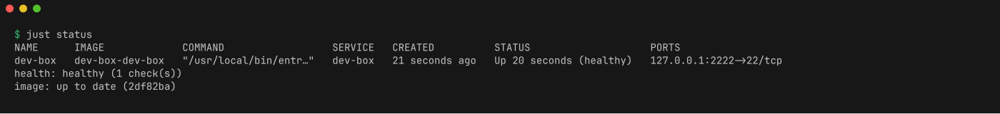

For a private fork, the in-box check needs a `GITHUB_TOKEN` that can read the repo.

## Persistence

Three bind mounts under `./data/` (git-ignored). A rebuild of the image loses nothing:

| Host | Container | Contents |
| --- | --- | --- |
| `./data/home` | `~` | config, mise toolchains, nvim plugins, pi/omp sessions, zsh history, SSH host keys, podman images |
| `${PROJECTS_DIR:-./data/projets}` | `~/projets` | your repositories |
| `./data/tailscale` | `/var/lib/tailscale` | tailscaled state (node identity) |

`~/projets` is a separate volume so it can be backed up, shared or pointed at another
disk independently. Only its top-level directory is ever chowned, when Docker created
it as root. Its contents are never touched. You can start from a fresh home
(`rm -rf data/home`) without affecting your projects.

## Backup

`scripts/backup.sh [--with-tailscale] [dest_dir]`, also `just backup`, writes
`dev-box-<TS_HOSTNAME>-<YYYYmmdd-HHMMSS>.tar.zst` into `dest_dir`, `./backups`
by default (git-ignored). It needs `zstd` on the host.

What goes in:

- `data/home`, minus the caches that rebuild themselves: `.cache`,
  `.local/share/{mise,nvim,dotarchy,lazyvim-starter}`, `.local/state/nvim`,
  `.npm`, `.bun`, and `.local/share/containers`, the podman image store, which is
  bulky, re-pullable, and full of files owned by mapped UIDs.
- The projects directory (`PROJECTS_DIR`), minus every `node_modules`.
  `.git/objects` is kept, so your repositories come back whole, with their history.
- A copy of `.env` and `compose.override.yaml` when they exist. `.env` holds
  `TS_AUTHKEY` and `GITHUB_TOKEN`, so treat the archive as a secret.

What stays out: `data/tailscale`. It holds the node identity, and restoring it
elsewhere would give you two machines claiming the same one. Pass
`--with-tailscale` if you really want it in the archive.

Ownership is preserved (`--numeric-owner`), and `sudo` is used only when
something that goes into the archive is not readable as you. The archive is read
back end to end after being written, and its entry count and size are printed.

Restoring:

```bash
./scripts/restore.sh backups/dev-box-dev-box-20260920-101500.tar.zst
# or: just restore backups/dev-box-dev-box-20260920-101500.tar.zst
```

It stops the container, lists what already exists and would be overwritten, asks
for confirmation, then unpacks at the root of the repo. Files are overwritten one
by one. Nothing outside the archive is ever deleted, so a home restored over a
newer one keeps whatever the archive does not mention. Add `--yes` to skip the
prompt. Outside a terminal the script refuses to run without it. Then bring the
box back with `just up`. The mise toolchains were not in the archive, so the start
reinstalls them, or you run `just update tools` (`devbox update tools` from inside).

If `PROJECTS_DIR` points outside the repo, on another disk, the projects are stored
under `projets-external/` in the archive and restored there. Move them back
yourself, the script will not write outside the repo.

## Troubleshooting and debug

- **Run without Tailscale.** See *SSH without Tailscale* above. With no
  `SSH_AUTHORIZED_KEYS` set, sshd does not start, the container stays up and reports
  unhealthy. Get in with `docker exec -it -u dev dev-box zsh -l`.
- **What is the box doing?** `devbox status` in one call: the commit the image was
  built from, Tailscale or sshd, podman, the active mise tools, and anything pending.
- **Logs.** `docker compose logs -f` shows the entrypoint, `dotarchy-sync`, `dev-box-seed`
  and `tailscale up` output, including the login URL when `TS_AUTHKEY` is empty.
- **mise install failed.** See `~/.cache/dev-box-install.log`. Rate-limit errors
  usually mean `GITHUB_TOKEN` is missing.
- **SSH refused, or port 22 filtered.** Check the Headscale policy: both the `ssh` rule
  and a `grants`/`acls` rule allowing traffic to the box are required.
- **Healthcheck.** Every 60 s: `tailscale status --peers=false`, or a connection to
  port 22 when `TS_DISABLE=true`.
- **`docker` says it cannot reach the API.** The podman socket did not start. See
  `~/.cache/dev-box-podman.log`, and check `PODMAN_ENABLE` and the podman block
  of `compose.override.yaml`.

## Design choices

- **No host Docker socket.** Mounting it would amount to root on the host. When
  containers are needed inside the box, rootless podman with the `docker` shim
  answers instead, as an opt-in. It costs part of the box's own isolation, so the
  default keeps the container as tight as Docker makes it.
- **Tailscale inside the container.** The box is only reachable from the tailnet,
  nothing is published on the host, and Tailscale SSH handles authentication.
- **amd64 and arm64.** The official `archlinux` image exists only for x86_64, so
  arm64 builds (Raspberry Pi 5) use Arch Linux ARM through the community image
  `menci/archlinuxarm:base`, rebuilt daily. BuildKit picks the base from
  `TARGETARCH`, and the rest of the image assumes nothing about the architecture.
- **Fixed UID/GID 1000:1000.** Same owner as on the host for the bind-mounted volumes.
