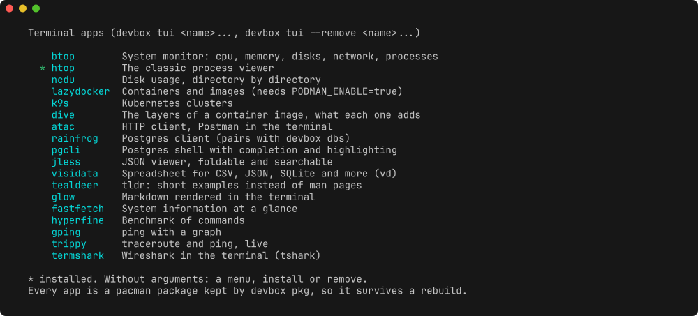

# Tools and packages

System packages come from pacman, in the image. Dev tools come from mise, in
the home. Each has a way to add more that survives a rebuild.

## System packages (pacman, in the image)

Everything the common-no-omarchy config and `try`/`proj` call (zsh, tmux, mise,
gum, starship, zoxide, fzf, eza, bat, ripgrep, fd, lazygit, jq, neovim,
luarocks, tree-sitter-cli), the base (tailscale, rsync, base-devel, gh, yazi,
...), the database clients `psql` and `mariadb` (see
[databases.md](databases.md)), the network basics `dig`, `nslookup`, `nc`,
`whois` and `traceroute` (`devbox dev-env network` for nmap, tcpdump and the
rest) and rootless podman (see [containers.md](containers.md)).

- Update Arch: rebuild the container,
  `docker compose build --pull --no-cache && docker compose up -d`, or
  `docker compose pull && docker compose up -d` when the box runs the
  published image.
- A `sudo pacman -S` inside the box is lost on rebuild. Add the package to the
  `Dockerfile` for good, or let `devbox pkg` (or `devbox tui`, for the
  catalogue) put it back at every start.

## Terminal apps

`devbox tui` is a catalogue of terminal apps worth having at hand, none of them
installed until you ask: btop, htop, ncdu, lazydocker, k9s, dive, atac,
rainfrog, pgcli, jless, visidata, tealdeer, glow, fastfetch, hyperfine, gping,
trippy and termshark. Every one is a pacman package present on Arch Linux and
Arch Linux ARM, and the install goes through `devbox pkg`, so the app comes
back after a rebuild.

```bash
devbox tui --list            # the catalogue, installed ones marked
devbox tui btop atac         # install
devbox tui --remove btop     # remove, and forget
devbox tui                   # menu: install or remove, then tick the apps
```



lazydocker only makes sense with rootless podman on (`PODMAN_ENABLE=true`).
What is already in the image stays out of the list: lazygit, yazi, fzf, bat,
eza, ripgrep, fd, jq, gum, tmux and neovim. Anything else from the Arch
repositories goes through `devbox pkg add` or the fuzzy picker of
`devbox pkg install`.

## Persistent packages

`devbox pkg` is the middle ground between a bare `sudo pacman -S`, which is
gone at the next rebuild, and an edit to the `Dockerfile`, which means a commit
and a rebuild. It installs the package and writes its name into
`~/.config/dev-box/packages`, which lives in the persistent home.

```bash
devbox pkg                        # menu: add, install, drop, list or restore
devbox pkg add ripgrep-all htop   # install, and remember
devbox pkg list                   # the list, and whether each one is there
devbox pkg install                # fuzzy picker over the Arch repositories
devbox pkg drop htop              # uninstall, and forget
devbox pkg restore                # put back whatever is missing
```

At every start the entrypoint reads that list and reinstalls what the image
does not have, in the background, without holding up the login. The log line
is `[dev-box] pkg: N package(s) reinstalled`.

Only packages come back. A config file you edited by hand in `/etc`, a systemd
unit, a file dropped in `/usr/local/bin`: none of that is tracked, and none of
it survives. The durable answer stays the `Dockerfile` in the repository.

## Dev tools (mise)

Dev tools live in the persistent home, declared in `~/.config/mise/config.toml`
(a seeded file, see
[customization.md](customization.md#seeded-files-and-devbox-seed)):

- `node` (LTS)
- `shellcheck` (`aqua:koalaman/shellcheck`, the lint of the scripts)

No coding agent is installed by default. `claude` (Claude Code,
`aqua:anthropics/claude-code`), `pi` (`aqua:earendil-works/pi`), `omp`
(`github:can1357/oh-my-pi`, via mise's github backend), `codex` (OpenAI Codex
CLI, `aqua:openai/codex`) and `opencode` each have a wrapper in
`/usr/local/bin`, which installs the tool on its first call: when mise cannot
find the command, it runs `mise use -g <tool>`, which adds the tool to
`~/.config/mise/config.toml`, then `mise x <tool> -- <cmd>`. Once installed,
the mise shims and activation run the tool directly. An installed tool is
never upgraded by its wrapper: `mise use -g <tool>` without a version reuses
the installed one. So a box only carries the agents it uses, and one removed
from the config comes back on its next call. `devbox mise-install` writes the
same kind of wrapper for any other tool, see
[customization.md](customization.md#wrappers-in-localbin-and-devbox-mise-install).

The declared tools are installed in the background on first start. Follow progress with
`tail -f ~/.cache/dev-box-install.log`. Later starts only reinstall what is
missing (`MISE_INSTALL_ON_START`), and never bump a version. Upgrading is
explicit: `devbox update tools` runs `mise install` then `mise upgrade`. Add
more on demand, for example `mise use -g go@latest`, or a whole language with
[`devbox dev-env`](dev-envs.md). Set `GITHUB_TOKEN`, no scopes needed, to avoid
GitHub API rate limits.
